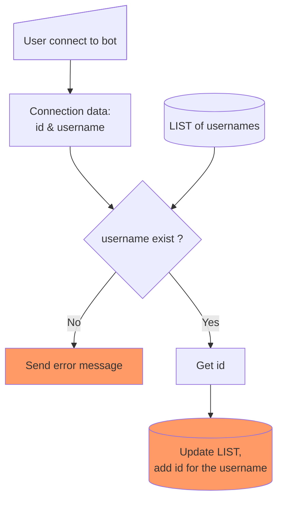
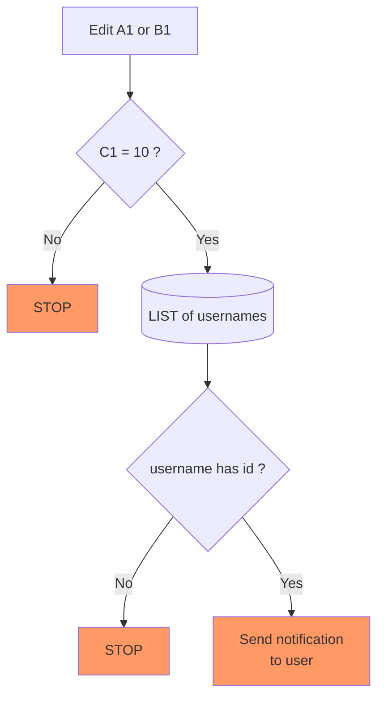

# Threshold Notification

## Overview
This is Google Apps Script to notify list of users if designated cell(s) in spreadsheet changed into certain values. Notifications are sent via Telegram's bot.

This use case is very useful when you have your staffs work on the spreadsheet and want to immediately notified if some calculations hit certain thresholds.

## Sheets configuration
In this example the script will notify users if cell `C1` hit 10, being `C1 = A1 + B1`.

<div align="center"></div>

## Apps Script configuration

- **`appsscript.json`**:

  ```json
  {
    "webapp": {
      "executeAs": "USER_DEPLOYING",
      "access": "ANYONE_ANONYMOUS"
    },
    "oauthScopes": [
      "https://www.googleapis.com/auth/spreadsheets",
      "https://www.googleapis.com/auth/script.external_request",
      "https://www.googleapis.com/auth/script.scriptapp"
    ]
  }
  ```

- **Apps Script -> Project Settings -> Script Properties:**

  Get `BOT_TOKEN` from Telegram's [@BotFather](https://t.me/BotFather).

  ```text
  {
    LIST: [
      {
        "name": "John Smith",
        "username": "johnsmith"
      },
      {
        "name": "Jane Doe",
        "username": "janedoe"
      }
    ]
    BOT_TOKEN: "..."
  }
  ```

- Add `editTrigger` in **Apps Script -> Triggers**.

- Deploy the script as webapp and copy the webapp's url to be used as [webhook](https://core.telegram.org/bots/api#setwebhook). Just visit this in browser:

  ```text
  https://api.telegram.org/bot{BOT_TOKEN}/setWebhook?url=https://script.google.com/macros/s/{Deployment-ID}/exec
  ```

## Get id for user



## Edit trigger



## References
- [Telegram API](https://core.telegram.org/api)
